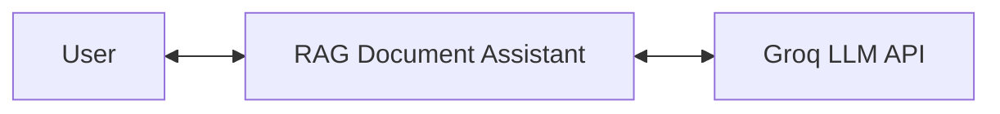
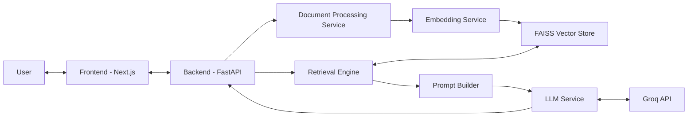
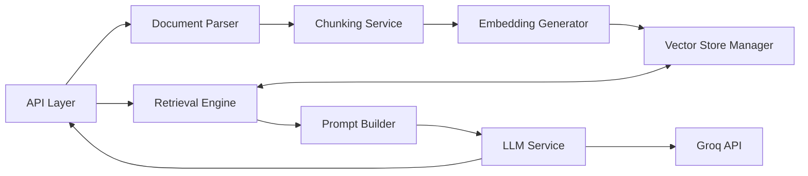

# RAG Document Assistant

Production-ready full-stack RAG system for uploading documents and getting grounded answers using semantic retrieval and Groq.

## 1) Overview (C4 - Context)

RAG Document Assistant is an AI system that ingests user documents (`PDF`, `DOCX`, `TXT`) and answers natural-language questions using only retrieved document context.

- **Primary user**: API/UI user who uploads files and asks questions.
- **Problem solved**: reliable document Q&A with grounded responses and auditable retrieval path.
- **External system**: Groq LLM API for final answer generation.

High-level context interaction:

`User ↔ RAG Document Assistant ↔ Groq LLM API`

- User sends files and questions to the system.
- System retrieves relevant chunks from indexed documents.
- System sends grounded prompt + context to Groq.
- System returns answer to the user.

### Context Diagram (Mermaid)



## 2) Architecture (C4 - Containers)

### Container: Frontend (`frontend/`)
- UI for auth, document management, file upload, query (answer mode / length), retrieval preview, citations, confidence, evidence spans, and thumbs feedback.
- Calls backend endpoints (authenticated unless noted):
  - `POST /auth/login`, `POST /auth/register`
  - `POST /upload`
  - `GET/PATCH /documents...` (list, metadata, versions, soft-delete/restore)
  - `POST /retrieve`, `POST /query`, `POST /answer`
  - `POST /feedback`
  - `GET /audit/...` (usage/history where enabled)

### Container: Backend (`backend/`)
- FastAPI runtime that orchestrates ingestion, scoped retrieval, grounded answer generation (JSON paragraphs + citations), explainability, audit, and feedback-driven learning signals.
- Enforces RBAC, quotas, and separation of concerns across the RAG pipeline.

### Container: Document Processing Service
- Extracts raw text from `PDF`, `DOCX`, `TXT`.
- Normalizes content.
- Splits into deterministic chunks.

### Container: Embedding Service
- Uses `SentenceTransformer` (`all-MiniLM-L6-v2`).
- Generates deterministic normalized vectors for chunks and queries.

### Container: Vector DB (FAISS)
- Stores chunk embeddings in local FAISS index.
- Stores metadata mapping (`document_id`, `chunk_id`, `order`, `text`).

### Container: Retrieval Engine
- **Hybrid** retrieval: normalized keyword signals + FAISS vector similarity; optional `keyword` / `vector` modes.
- Respects **metadata filters** (tags, author, date) and **multi-document** scopes before ranking.
- Applies **learned** per-chunk deltas and hybrid weight nudges from `learning_signals.json` (updated only via `/feedback`, affecting **future** queries).

### Container: Groq API (External LLM)
- Receives grounded JSON-oriented prompts and returns structured paragraph + citation payloads (`answer_json`).
- Used only through backend LLM service (no direct frontend call).

### Container Diagram (Mermaid)



## 3) System Design (C4 - Components)

Backend components and responsibilities:

### API Layer
- FastAPI routes for auth, documents (CRUD-ish + versioning), upload, retrieval, query/answer, feedback, and audit.
- Validates request/response contracts (including citations, confidence, evidence spans on `/query` and `/answer`).

### Document Parser
- File-type parsing:
  - TXT decode
  - PDF extraction
  - DOCX extraction

### Chunking Service
- Cleans/normalizes text.
- Produces ordered chunks with deterministic IDs.

### Embedding Generator
- Generates chunk/query embeddings.
- Applies L2 normalization for cosine-like similarity behavior.

### Vector Store Manager
- Inserts vectors into FAISS.
- Maintains vector position -> metadata mapping.

### Retrieval Engine
- Hybrid ranking over scoped chunks; deterministic ordering with tie-breakers.
- Shared **retrieval scope** resolution for `/retrieve` and `/query` (single doc, optional `document_ids`, filters).

### Prompt Builder
- Builds grounded prompts with labeled chunk ids, **strict vs flexible** rules, **answer length** hints, and JSON output schema for paragraphs + citations.

### LLM Service (Groq Integration)
- Uses Chat Completions with `response_format: json_object` when supported; parses JSON for paragraphs/citations.
- Deterministic generation params (`temperature=0`, `top_p=1`) where applicable.

### RAG pipeline & explainability
- Post-processes citations, **strict verbatim** enforcement, **answer confidence** (support/relevance/agreement), and **evidence spans** (verbatim slices into chunk text).

### Feedback & learning (Phase 2.4)
- `FeedbackStore` (`feedback.jsonl`) + `LearningSignalsStore` (`learning_signals.json`); **does not rewrite past answers**.

Component flow (ingestion):

`API → Parser → Chunker → Embeddings → FAISS`

Component flow (question answering):

`API → Retrieval scope → Retrieval Engine → Prompt Builder → Groq (JSON) → RAG post-process (citations / confidence / spans) → API Response`

Optional:

`API → Feedback → Learning signals → affects future Retrieval Engine`

### Component Diagram (Mermaid)



## 4) Data Flow

### Upload Flow
`File -> Parsing -> Chunking -> Embedding -> FAISS Storage`

1. User uploads a document.
2. Text is extracted and normalized.
3. Text is chunked with deterministic ordering.
4. Each chunk is embedded.
5. Embeddings + metadata are stored in FAISS.

### Query Flow
`Question → Scope (RBAC + optional multi-doc + filters) → Hybrid retrieval → Prompt (mode + length) → Groq JSON → Citations / confidence / evidence → Answer`

1. User sends `POST /query` with `question`, anchor `document_id`, optional `document_ids`, optional `filters`, `retrieval_mode`, `answer_mode`, `answer_length`, `top_k`.
2. Backend resolves allowed logical documents and maps active **index** ids for FAISS chunks.
3. Retrieval runs **hybrid** (or forced keyword/vector mode), applies learned deltas/weights, returns ranked chunks with `relevance_score` and metadata.
4. Prompt builder formats all scoped chunks for the LLM and requests JSON paragraphs with citations.
5. Groq returns structured text; strict mode enforces verbatim alignment where possible.
6. Response includes **`answer`**, **per-paragraph `citations`**, **`confidence`**, and **`evidence_spans`** (verbatim spans into sources).
7. Low-confidence or empty answers also emit an audit **`query_quality_issue`** entry (Phase 2.4).
8. User may send **`POST /feedback`** (snapshots + 👍/👎); persistence updates signals for **subsequent** retrievals only.

---

## 5) Phase 1 — Foundation (`specs/1`)

Phase 1 delivers **secure multi-tenant document operations**, **versioning**, **metadata/tag filtering**, **auditability**, and **deployment readiness**.

| Sub-phase | What was implemented |
|-----------|-------------------------|
| **1.1** | JWT auth, roles (`admin` / `user` / `viewer`), quotas, protected routes |
| **1.2** | Per-owner documents, collections, `STORAGE_PATH` persistence, upload validation |
| **1.3** | Version stack per document, new uploads as versions, soft delete & restore |
| **1.4** | Tags + structured metadata, `PATCH` updates, list filtering |
| **1.5** | Append-only `audit.log`, usage history & admin log views |
| **1.6** | Render/Vercel-oriented config (`render.yaml`, health/ready, env-driven URLs) |

**Diagrams (Mermaid):** see [`specs/1/DIAGRAMS.md`](specs/1/DIAGRAMS.md).

---

## 6) Phase 2 — AI & Retrieval Intelligence (`specs/2`)

Phase 2 turns retrieval + answering into a **single grounded pipeline** with **explainability** and a **feedback loop**.

| Sub-phase | What was implemented |
|-----------|-------------------------|
| **2.1** | Hybrid keyword + vector retrieval; metadata pre-filters; multi-document scope; deterministic ranking; `/retrieve` empty-scope guard |
| **2.2** | `answer_mode` (`strict` / `flexible`), `answer_length`, JSON paragraphs + citations; `/query` & `/answer` aligned with shared scope resolution |
| **2.3** | Reproducible **`confidence`** score; **`evidence_spans`** (offsets + verbatim excerpts; sources never mutated) |
| **2.4** | `POST /feedback`, `feedback.jsonl`; `learning_signals.json` (chunk deltas, hybrid nudges, re-index queue); `query_quality_issue` audit |

**Note:** Answer **confidence** summarizes evidence for that response; **learned signals** from feedback adjust **future** retrieval—not the same request’s ranking.

**Diagrams (Mermaid):** see [`specs/2/DIAGRAMS.md`](specs/2/DIAGRAMS.md).

---

## 7) Tech Stack

- **Backend**: FastAPI, Python
- **Embeddings**: SentenceTransformers (`all-MiniLM-L6-v2`)
- **Vector Store**: FAISS (`faiss-cpu`)
- **LLM**: Groq API
- **Frontend**: Next.js + React + Three.js
- **Testing**: Pytest

## 8) How to Run

### Prerequisites
- Python 3.11+
- Node.js 18+

### 1. Backend setup

```bash
cd backend
pip install -r requirements.txt
```

Create `backend/.env`:

```env
GROQ_API_KEY=your_groq_api_key_here
GROQ_MODEL=llama-3.1-8b-instant
GROQ_BASE_URL=https://api.groq.com/openai/v1
JWT_SECRET=your_long_random_secret
TOKEN_EXPIRY=60
STORAGE_PATH=storage
```

Run backend:

```bash
uvicorn app.main:app --reload --port 8000
```

### 2. Frontend setup

```bash
cd frontend
npm install
npm run dev
```

Frontend default URL: `http://localhost:3000`  
Backend default URL: `http://127.0.0.1:8000`

Optional env in `frontend/.env.local`:

```env
NEXT_PUBLIC_BACKEND_URL=http://127.0.0.1:8000
```

### 3. Run tests

```bash
cd backend
pytest ../tests -q
```

Focused checks:

```bash
pytest ../tests/test_phase2_e2e_integration.py ../tests/test_phase9_evaluation.py -q
```

## 🧭 Future Enhancements

### 🔐 Authentication & Role Management
- [ ] Improve Login/Register UI with modern UX (validation, animations, error states)
- [ ] Add full Role-Based Access Control (RBAC)
- [ ] Replace dev bootstrap system with secure admin invitation flow
- [ ] Add password reset and email verification (optional)

---

### 🧑‍💼 Admin System
- [ ] Admin Assigning Panel (Bootstrap admin creation via secret key)
- [ ] Admin-only routes protection middleware
- [ ] Admin activity audit logs
- [ ] Admin user management dashboard (view / promote / deactivate users)

---

### 📊 System Monitoring (Phase 3 UX)
- [ ] Real-time analytics dashboard (queries, storage, token usage)
- [ ] System health indicators (latency, failures, uptime)
- [ ] Live activity feed (queries, uploads, AI responses)
- [ ] Error monitoring and classification panel

---

### 🎨 UX Enhancements
- [ ] Fully responsive SaaS-style dashboard redesign
- [ ] Improved navigation system (Admin / User separation)
- [ ] Advanced loading skeletons and micro-interactions
- [ ] Dark mode support (optional)

## 9) Key Design Principles

- **Deterministic behavior**: consistent embeddings/retrieval for same input.
- **Modular architecture**: isolated services and use-cases.
- **Grounded responses**: answer generation constrained to retrieved context.
- **Separation of concerns**: API, processing, retrieval, prompting, LLM separated.
- **Spec-driven development**: Phase 1 (`specs/1`) and Phase 2 (`specs/2`) are implemented end-to-end; see diagram indexes above.
