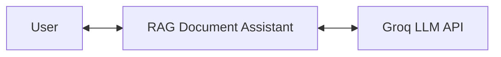
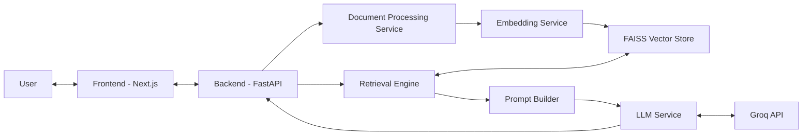
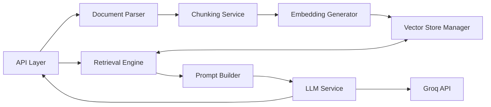

# RAG Document Assistant

Production-ready full-stack RAG system for uploading documents and getting grounded answers using semantic retrieval and Groq.

## 1) Overview (C4 - Context)

RAG Document Assistant is an AI system that ingests user documents (`PDF`, `DOCX`, `TXT`) and answers natural-language questions using only retrieved document context.

- **Primary user**: API/UI user who uploads files and asks questions.
- **Problem solved**: reliable document Q&A with grounded responses and auditable retrieval path.
- **External system**: Groq LLM API for final answer generation.

High-level context interaction:

`User ↔ RAG Document Assistant ↔ Groq LLM API`

- User sends files and questions to the system.
- System retrieves relevant chunks from indexed documents.
- System sends grounded prompt + context to Groq.
- System returns answer to the user.

### Context Diagram (Mermaid)



## 2) Architecture (C4 - Containers)

### Container: Frontend (`frontend/`)
- UI for file upload, query input, and answer/chunk display.
- Calls backend endpoints:
  - `POST /upload`
  - `POST /retrieve`
  - `POST /query`

### Container: Backend (`backend/`)
- FastAPI runtime that orchestrates ingestion, retrieval, and answer generation.
- Enforces sequence and separation of concerns in the RAG pipeline.

### Container: Document Processing Service
- Extracts raw text from `PDF`, `DOCX`, `TXT`.
- Normalizes content.
- Splits into deterministic chunks.

### Container: Embedding Service
- Uses `SentenceTransformer` (`all-MiniLM-L6-v2`).
- Generates deterministic normalized vectors for chunks and queries.

### Container: Vector DB (FAISS)
- Stores chunk embeddings in local FAISS index.
- Stores metadata mapping (`document_id`, `chunk_id`, `order`, `text`).

### Container: Retrieval Engine
- Converts query to embedding.
- Searches FAISS.
- Filters by `document_id`, ranks and returns top-K chunks.

### Container: Groq API (External LLM)
- Receives grounded prompt and returns final answer.
- Used only through backend LLM service (no direct frontend call).

### Container Diagram (Mermaid)



## 3) System Design (C4 - Components)

Backend components and responsibilities:

### API Layer
- FastAPI routes for upload, retrieval, and query.
- Validates request/response contracts.

### Document Parser
- File-type parsing:
  - TXT decode
  - PDF extraction
  - DOCX extraction

### Chunking Service
- Cleans/normalizes text.
- Produces ordered chunks with deterministic IDs.

### Embedding Generator
- Generates chunk/query embeddings.
- Applies L2 normalization for cosine-like similarity behavior.

### Vector Store Manager
- Inserts vectors into FAISS.
- Maintains vector position -> metadata mapping.

### Retrieval Engine
- Runs similarity search.
- Returns sorted top-K chunk results for a document.

### Prompt Builder
- Builds grounded prompt with:
  - system instruction
  - retrieved context blocks
  - user question
  - fallback instruction for insufficient context

### LLM Service (Groq Integration)
- Sends prompt to Groq Chat Completions API.
- Uses deterministic generation params (`temperature=0`, `top_p=1`).

Component flow:

`API -> Parser -> Chunker -> Embeddings -> FAISS -> Retrieval -> Prompt Builder -> Groq -> API Response`

### Component Diagram (Mermaid)



## 4) Data Flow

### Upload Flow
`File -> Parsing -> Chunking -> Embedding -> FAISS Storage`

1. User uploads a document.
2. Text is extracted and normalized.
3. Text is chunked with deterministic ordering.
4. Each chunk is embedded.
5. Embeddings + metadata are stored in FAISS.

### Query Flow
`Question -> Embedding -> Retrieval -> Prompt Builder -> Groq -> Answer`

1. User sends question + `document_id`.
2. Query embedding is generated.
3. FAISS retrieval returns top-K relevant chunks.
4. Prompt builder injects context + question.
5. Groq generates answer from provided context.
6. System returns grounded answer.

## 5) Tech Stack

- **Backend**: FastAPI, Python
- **Embeddings**: SentenceTransformers (`all-MiniLM-L6-v2`)
- **Vector Store**: FAISS (`faiss-cpu`)
- **LLM**: Groq API
- **Frontend**: Next.js + React + Three.js
- **Testing**: Pytest

## 6) How to Run

### Prerequisites
- Python 3.11+
- Node.js 18+

### 1. Backend setup

```bash
cd backend
pip install -r requirements.txt
```

Create `backend/.env`:

```env
GROQ_API_KEY=your_groq_api_key_here
GROQ_MODEL=llama-3.1-8b-instant
GROQ_BASE_URL=https://api.groq.com/openai/v1
```

Run backend:

```bash
uvicorn app.main:app --reload --port 8000
```

### 2. Frontend setup

```bash
cd frontend
npm install
npm run dev
```

Frontend default URL: `http://localhost:3000`  
Backend default URL: `http://127.0.0.1:8000`

Optional env in `frontend/.env.local`:

```env
NEXT_PUBLIC_BACKEND_URL=http://127.0.0.1:8000
```

### 3. Run tests

```bash
cd backend
pytest ../tests/test_phase9_evaluation.py -q
```

## 7) Key Design Principles

- **Deterministic behavior**: consistent embeddings/retrieval for same input.
- **Modular architecture**: isolated services and use-cases.
- **Grounded responses**: answer generation constrained to retrieved context.
- **Separation of concerns**: API, processing, retrieval, prompting, LLM separated.
- **Spec-driven development**: implementation follows phased specs (`specs/1` to `specs/9`).
