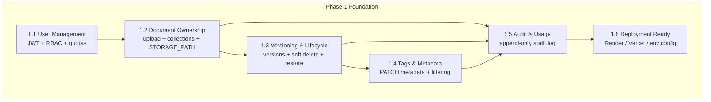
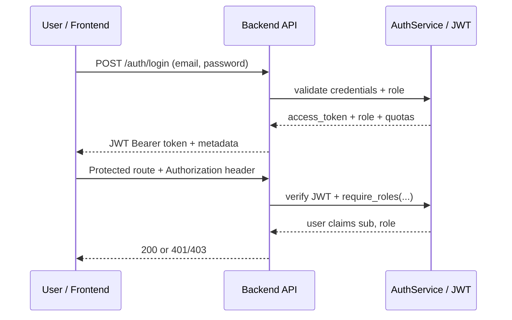
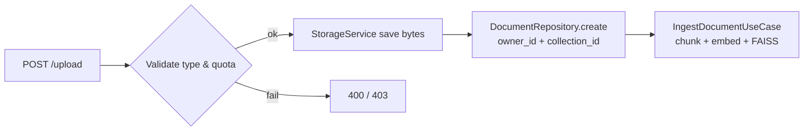
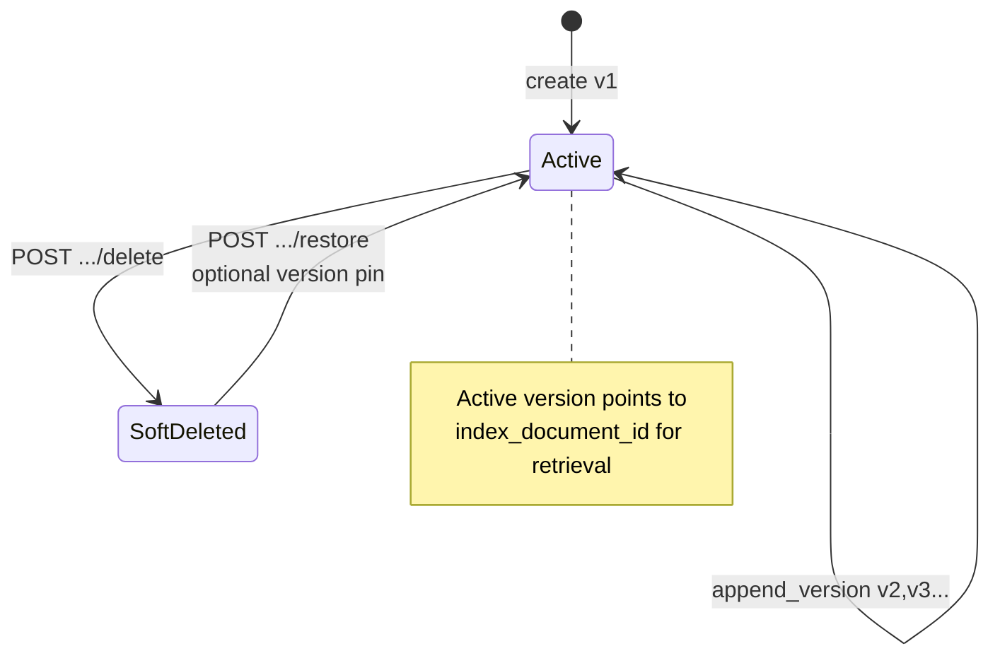
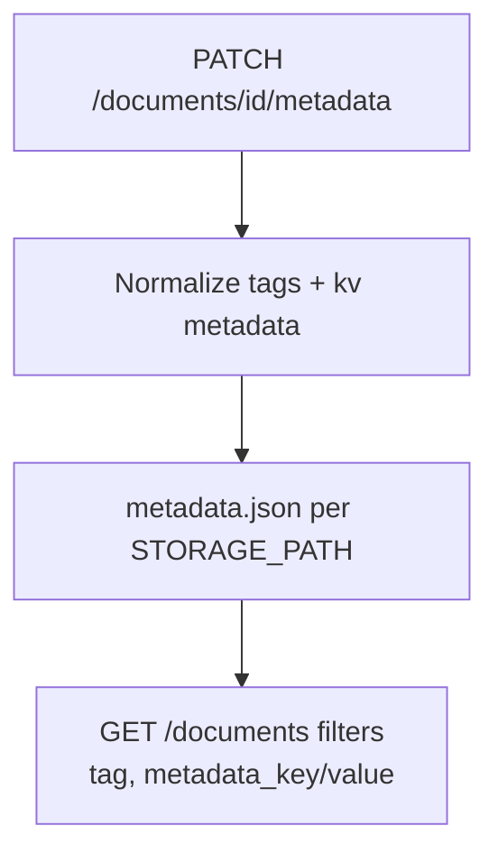
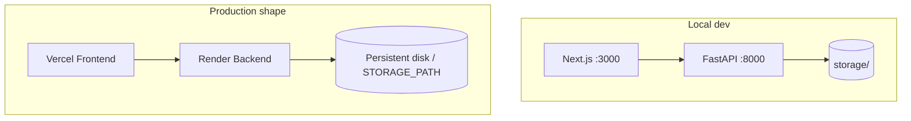

# Phase 1 — Mermaid diagrams (Foundation)

Diagrams summarize **`specs/1`** phases: auth, documents, versioning, metadata, audit, deployment.

---

## Phase 1 — Big picture



---

## 1.1 — Authentication & authorization



---

## 1.2 — Document ownership & upload



---

## 1.3 — Versioning & lifecycle



---

## 1.4 — Tags & metadata



---

## 1.5 — Audit logging

```mermaid
flowchart LR
    EV[upload / query / feedback / ...] --> AUD[AuditService.log_event]
    AUD --> LOG[(audit.log append-only JSONL)]
    LOG --> USE[/audit/usage-history<br/>/audit/logs admin]
```

---

## 1.6 — Deployment topology


