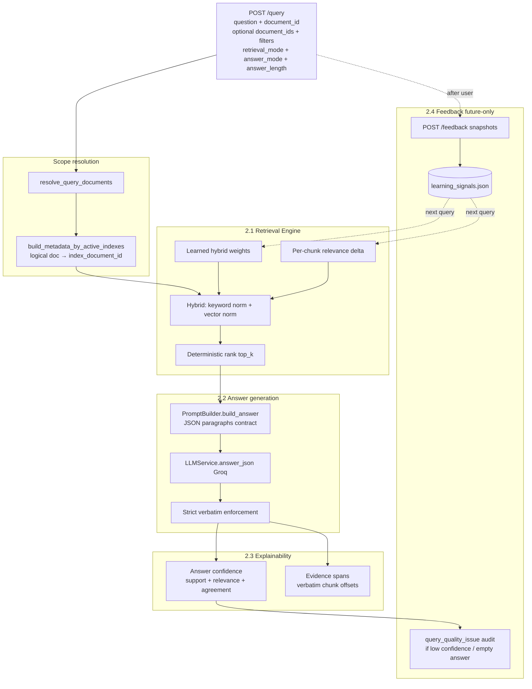
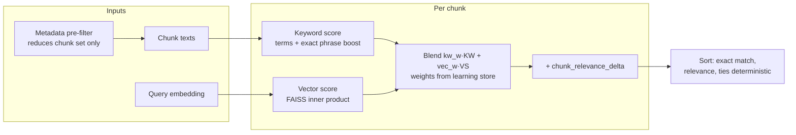
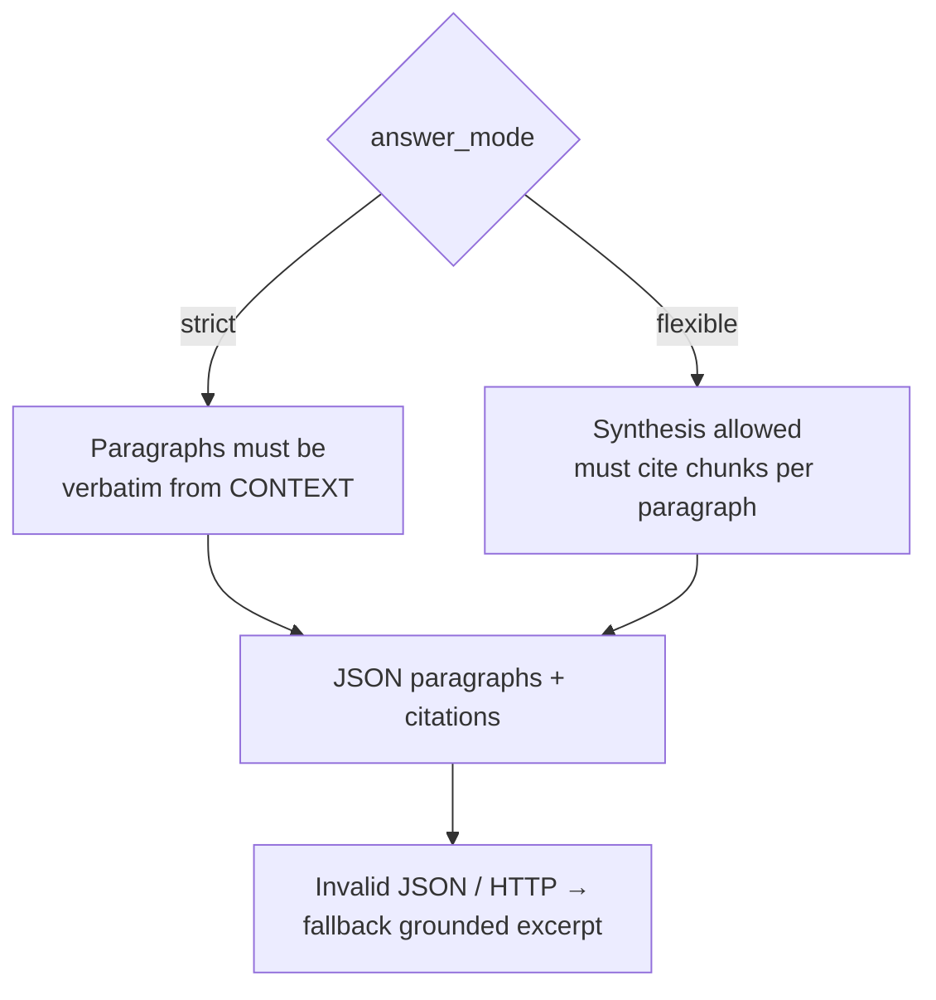
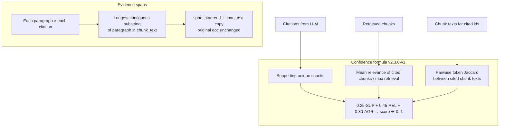
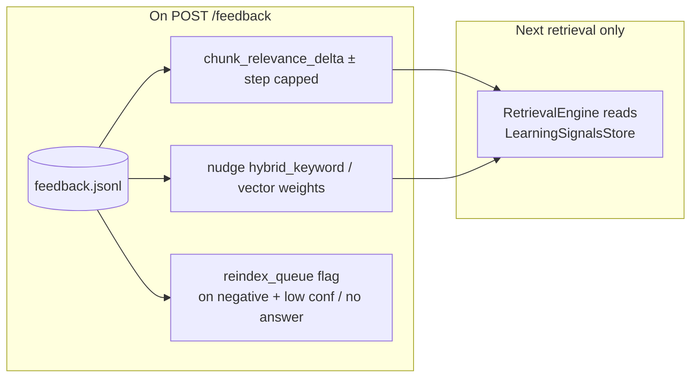

# Phase 2 — Mermaid diagrams (AI & Retrieval Intelligence)

Diagrams summarize **`specs/2`** sub-phases and how they chain in one pipeline.

---

## Phase 2 — End-to-end pipeline (single request)

---

## 2.1 — Hybrid retrieval scoring (conceptual)

---

## 2.2 — Answer modes

---

## 2.3 — Confidence & evidence spans

---

## 2.4 — Feedback loop (past answers immutable)

